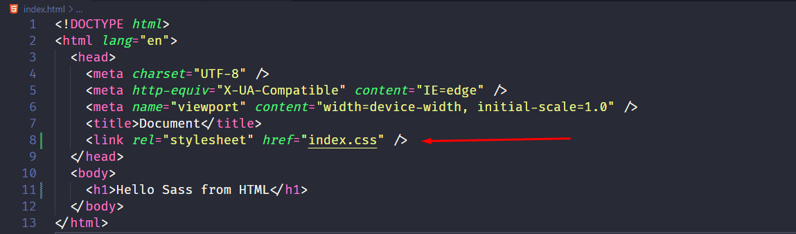
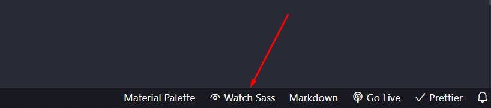

# The Ultimate Git Repository for learning Sass


## Shortcuts

- [Sass variables](#scss-variables)
- [Sass Nesting CSS rules](#sass-nesting-css-rules)
- [Differences between Scss, Sass and Css extension](#differences-between-scss-sass-and-css-extension)

## Advantages of using Sass:

- **Accessibility:** Ability to run via an internet browser 24/7 from any device
- **Operational Management:** No installation, equipment updates or traditional licensing management
- **Cost Effective:** No upfront hardware costs and flexible payment methods such as pay-as-you-go models
- **Scalability:** Easily scale a solution to accommodate changing needs
- **Data Storage:** Data is routinely saved in the cloud
- **Analytics:** Access to data reporting and intelligence tools
- **Increase Security:** SaaS providers invest heavily in security technology and expertise

## Prerequisites for learning Sass

- HTML
- CSS
- Javascript (Fundamental)

**_SASS Stand for_**

```markdown
Syntactically Awesome Stylesheet
```

## Why we use Sass?

**Sass (Syntactically Awesome Stylesheets) is a CSS pre-processor that lets you use variables, mathematical operations, mixins, loops, functions, imports, and other interesting functionalities that make writing CSS much more powerful.**

_Some more information about SASS._

- Sass is an extension to CSS
- Sass is a CSS pre-processor
- Sass is completely compatible with all versions of CSS
- Sass reduces repetition of CSS and therefore saves time
- Sass was designed by Hampton Catlin and developed by Natalie Weizenbaum in 2006
- Sass is free to download and use

## How to use SASS in your HTML?

### Step 01

```html
Install the Live Sass Compiler extension.
```

If you are in **VS code editor** you need to install an extensions called **[Live SASS compiler](https://marketplace.visualstudio.com/items?itemName=ritwickdey.live-sass)** from extension marketplace in your code editor, as you can see in the image.


### Step 02

```html
Create your HTML file and name it index.html. Include the
<h1>element that we want to style with SASS.</h1>
```


[**_Please note that browsers do not recognize SASS, so a compiler needs to compile it to CSS._**]

### Step 03

```text
Create a .scss file at the same root level as your index.html
file and name it index.scss This is our SASS file.
```


### Step 04

```html
Add the following code that will style your
<h1>element.</h1>
```

```css
$red-bg: red;
h1 {
  background-color: $red-bg;
}
```

### Step 05

**_Don't forget to write .css extension_**

```html
Add the following to the tag of your HTML file.
<head>
  <link rel="stylesheet" href="index.css" />
</head>
```

**_It's look like this_**



### Step 06

Now, to start the compiler, click “Watch Sass”. This will compile the SASS code to CSS.



**_Now You are done with Sass_**

### Differences between Scss, Sass and Css extension

- Scss and Css syntax are the same
- But sass extension syntaxes are not same

Sass has two options for using different syntax although both will be written like programming language. One is SCSS, which uses the same syntax as CSS but adds Sass features, this syntax has eased every developer’s problem when dealing with “Ruby syntax”. SASS was a part of another preprocessor called Haml(HTML abstraction markup language), designed and written by Ruby developers. Therefore, Sass stylesheets use the same syntax as Ruby with no curly braces {}, semicolons; and strict indentation. This is not similar to CSS, variables are declared by using “!” not “$”, the assignment is “=” not “:”. So, if you are not familiar with Ruby language, SCSS is a good choice. This topic uses SCSS.

```sass
/*SASS*/

$color1: red
$color2: blue

a
    color: $color1
    &:hover
        color: $color2


/*SCSS*/

$color1: red;
$color2: blue;

a {
    color: $color1;
    &:hover {
        color: $color2;
      }
    }


/*CSS*/

a {
    color: red;
}
a:hover {
    color: blue;
}
```

**_Scss and Css is the same syntax_**


**_Sass and Css isn't same syntax_**


## Scss variables

**_Variables are a way to store information that you can re-use later. With Sass, you can store information in variables are those types of data_**

- strings
- numbers
- colors
- booleans
- lists
- nulls

```text
In order to declare variables, we use the “$” sign and variable’s name
and “:” after that. After “:” the value will be assigned by then and
finish with “;”. For example, we can declare a $main-color variable,
and the value of this variable is #0033cc (blue color). As simple as that.
```


Declaring variables help programmers save a ton of time. For example, in a website layout, there are many positions, and each position has its own background, if we write CSS code like before, this could be very difficult when changing. There are also cases where many locations use the same background, so if the normal CSS code is changed, each position will have to replace many locations. But if we use the variable to store the background, we only need to replace the correct one position.

### Scope of variables

The variable declared at the top of the stylesheet is a global variable. This means it can be used anywhere in your module after it is declared. Variables declared in blocks (brackets in SCSS or indent in SASS) are usually local and can only be used in blocks in which they are declared.

```scss
$global-variable: red;

.login-text {
  $local-variable: blue;
  color: $local-variable;
}
.about-text {
  color: $local-variable;
}
```

## Sass Nesting CSS rules

**_You can nest properties in Sass, it is cleaner and easier to read than standard CSS._**

- Notice that in Sass, the ul, li, and a selectors are nested inside the nav selector.

```scss
nav {
  ul {
    margin: 0;
    padding: 0;
    list-style: none;
  }
  li {
    display: inline-block;
  }
  a {
    display: block;
    padding: 6px 12px;
    text-decoration: none;
  }
}
```

- While in CSS, the rules are defined one by one (not nested):

```css
nav ul {
  margin: 0;
  padding: 0;
  list-style: none;
}
nav li {
  display: inline-block;
}
nav a {
  display: block;
  padding: 6px 12px;
  text-decoration: none;
}
```

### Sass Nested Properties

Many CSS properties have the same prefix, like font-family, font-size and font-weight or text-align, text-transform and text-overflow.

- With Sass you can write them as nested properties:

```scss
font: {
  family: Helvetica, sans-serif;
  size: 18px;
  weight: bold;
}

text: {
  align: center;
  transform: lowercase;
  overflow: hidden;
}
```

- On the other hand in CSS properties syntax is like that

```css
font-family: Helvetica, sans-serif;
font-size: 18px;
font-weight: bold;

text-align: center;
text-transform: lowercase;
text-overflow: hidden;
```
