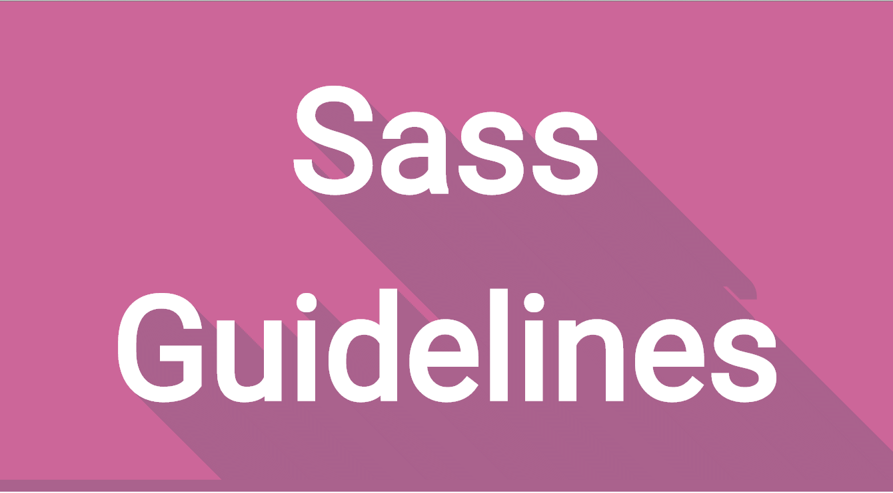

# The Ultimate Git Repository for learning Sass



## Shortcuts

- [Sass variables and nesting CSS rules](Sass-variables-and-nesting-CSS-rules)

## Advantages of using Sass :

- **Accessibility:** Ability to run via an internet browser 24/7 from any device
- **Operational Management:** No installation, equipment updates or traditional licensing management
- **Cost Effective:** No upfront hardware costs and flexible payment methods such as pay-as-you-go models
- **Scalability:** Easily scale a solution to accommodate changing needs
- **Data Storage:** Data is routinely saved in the cloud
- **Analytics:** Access to data reporting and intelligence tools
- **Increase Security:** SaaS providers invest heavily in security technology and expertise

## Prerequisites for learning Sass

- HTML
- CSS
- Javascript (Fundamental)

**_SASS Stand for_**

```markdown
Syntactically Awesome Stylesheet
```

## Why we use Sass?

**Sass (Syntactically Awesome Stylesheets) is a CSS pre-processor that lets you use variables, mathematical operations, mixins, loops, functions, imports, and other interesting functionalities that make writing CSS much more powerful.**

_Some more information about SASS._

- Sass is an extension to CSS
- Sass is a CSS pre-processor
- Sass is completely compatible with all versions of CSS
- Sass reduces repetition of CSS and therefore saves time
- Sass was designed by Hampton Catlin and developed by Natalie Weizenbaum in 2006
- Sass is free to download and use

## How to use SASS in your HTML?

## Step 01

```html
Install the Live Sass Compiler extension.
```

If you are in **VS code editor** you need to install an extensions called **[Live SASS compiler](https://marketplace.visualstudio.com/items?itemName=ritwickdey.live-sass)** from extension marketplace in your code editor, as you can see in the image.


## Step 02

```html
Create your HTML file and name it index.html. Include the
<h1>element that we want to style with SASS.</h1>
```


[**_Please note that browsers do not recognize SASS, so a compiler needs to compile it to CSS._**]

## Step 03

```text
Create a .scss file at the same root level as your index.html
file and name it index.scss This is our SASS file.
```


## Step 04

```html
Add the following code that will style your
<h1>element.</h1>
```

```css
$red-bg: red;
h1 {
  background-color: $red-bg;
}
```

## Step 05

**_Don't forget to write .css extension_**

```html
Add the following to the tag of your HTML file.
<head>
  <link rel="stylesheet" href="index.css" />
</head>
```

**_It's look like this_**


## Step 06

Now, to start the compiler, click “Watch Sass”. This will compile the SASS code to CSS.


## Sass variables and nesting CSS rules
